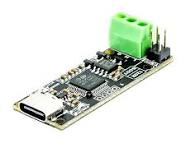
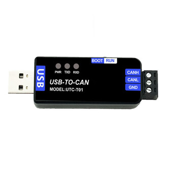
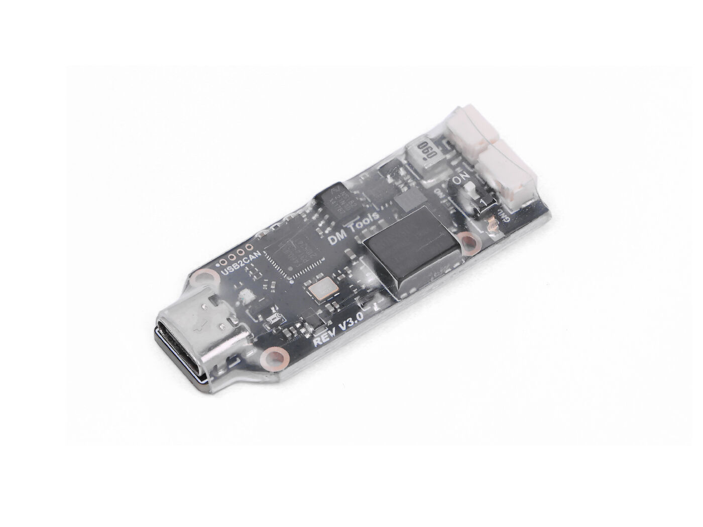
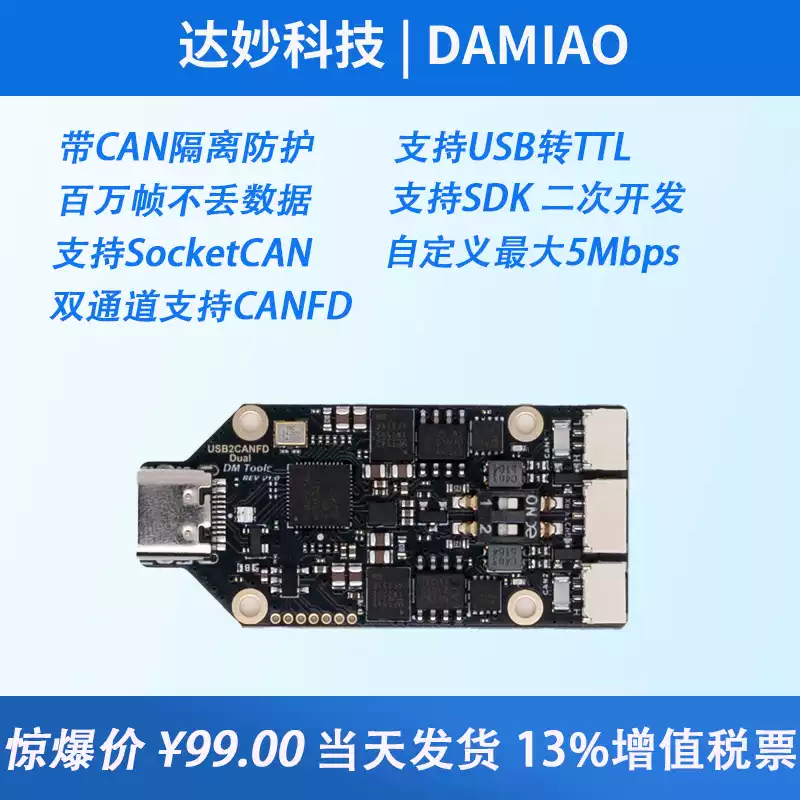
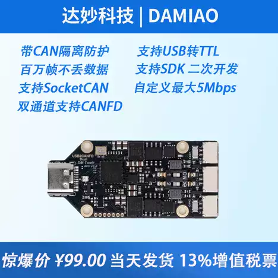
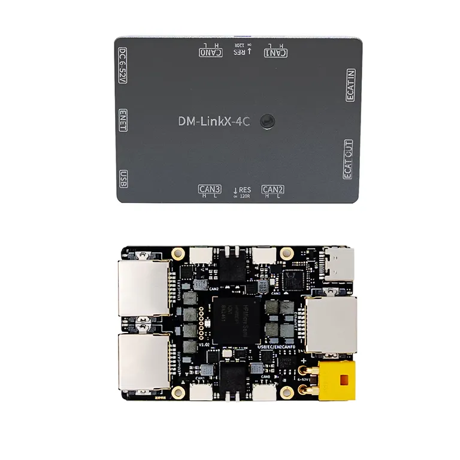
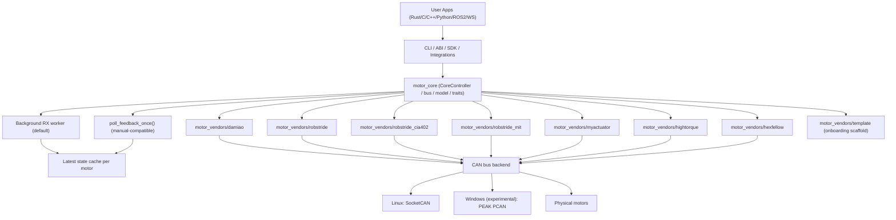
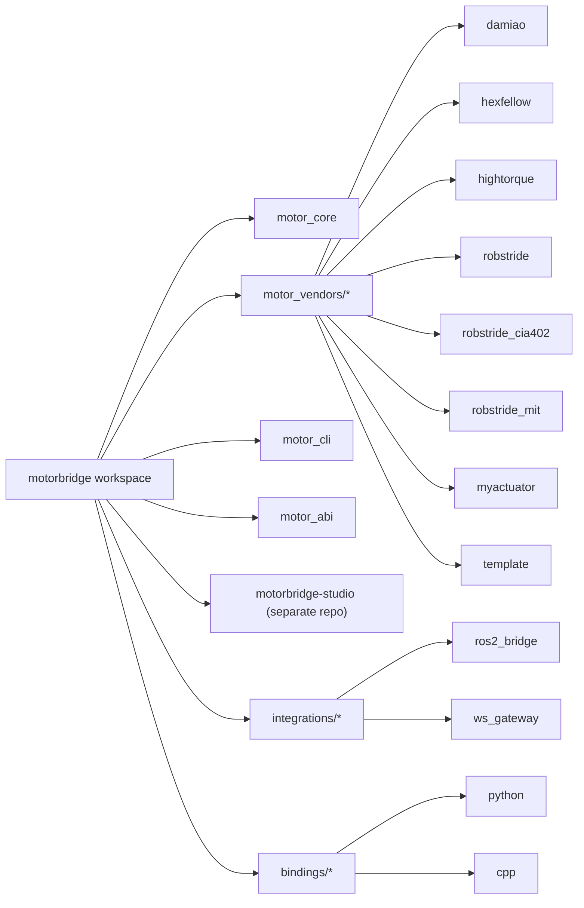
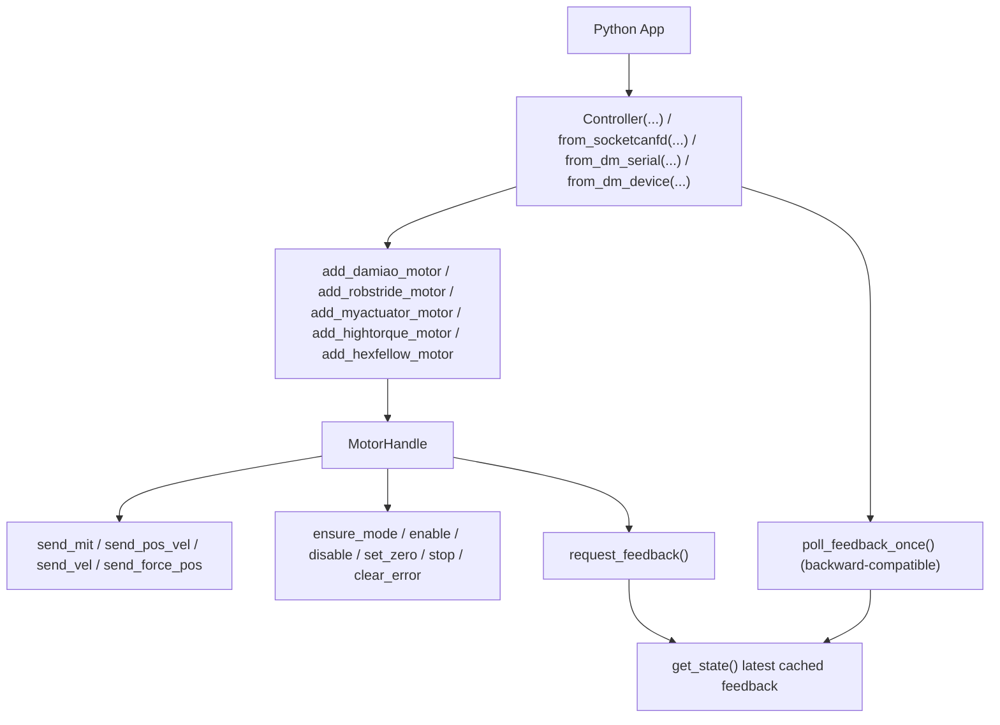

# motorbridge

[](https://www.rust-lang.org/)
[](https://www.python.org/)
[](LICENSE)
[](README.md#release-and-installation-overview-full-matrix)
[](https://github.com/tianrking/motorbridge/releases)

Unified CAN motor control stack with a vendor-agnostic Rust core, stable C ABI, and Python/C++ bindings.

> Chinese version: [README.zh-CN.md](README.zh-CN.md)

## Companion Repos

- `motorbridge-studio`: https://github.com/tianrking/motorbridge-studio
  Standalone web control UI built on top of `ws_gateway`.

## Update (2026-06): v0.4.7

- `v0.4.7` hardens Damiao `ensure_mode` by switching to a shared timeout budget,
  reusing the hold-position read during mode preparation, and improving mode
  write verification. This reduces timeout failures during mode changes and
  parameter persistence on real hardware.
- `v0.4.7` raises the `dm-serial` transport timeout from `1 ms` to `10 ms` to
  reduce cross-platform serial write failures under tighter adapter/driver
  timing.
- `v0.4.6` reuses existing Damiao motor handles during `damiao_state_many`
  polling so repeated browser telemetry does not fail on duplicate motor
  registration.
- `v0.4.6` lets browser clients authenticate `ws_gateway` by sending
  `MOTORBRIDGE_WS_TOKEN` in the WebSocket URL query as
  `?motorbridge_ws_token=...`, while keeping the existing non-loopback token
  requirement and header-based auth paths.
- `v0.4.5` improves Damiao `ensure_mode` reliability by retrying the `RID 10`
  mode-register write after failed readback verification attempts and using a
  conservative shared 20 ms retry gap across platforms, adapters, and
  transports.
- `v0.4.5` adds experimental RobStride standard-frame preview paths:
  `robstride_cia402` for CANopen/CiA402 (`F_CMD=1`) and `robstride_mit` for
  MIT protocol (`F_CMD=2`). These command surfaces are documented for testing
  and protocol bring-up, but are not production-ready yet.
- `v0.4.5` adds hardware gallery media and adapter documentation for common CAN
  and Damiao setups.
- `v0.4.4` adds the Damiao-only `dm-device` transport for DaMiao
  `USB2CANFD`, `USB2CANFD_DUAL`, and `LINKX4C` adapters through the
  DM_Device SDK. Rust CLI, Python SDK, Python CLI, Python wheels, C ABI, and
  `ws_gateway` now share the same
  `--transport dm-device --dm-device-type ... --dm-channel ...` path. This
  transport is currently wired only to Damiao motor protocol, and the adapter
  must be configured/connected in USB mode.
- In `dm-device` scan mode, omit `--dm-channel` / `dm_channel` to scan all
  channels on the selected adapter: channel `0` on `usb2canfd`, channels `0|1` on
  `usb2canfd-dual`, or channels `0|1|2|3` on `linkx4c`.

DM_Device_SDK is a software development kit for CAN/CAN FD adapter devices.
motorbridge currently supports these DM_Device hardware types, while the
`dm-device` motor transport is wired only to Damiao motor protocol:

| Device Type | SDK Enum | Channels | `--dm-device-type` | Channel Selection |
|---|---|---:|---|---|
| USB2CANFD | `USB2CANFD` | 1 | `usb2canfd` | `--dm-channel 0` |
| USB2CANFD_DUAL | `USB2CANFD_DUAL` | 2 | `usb2canfd-dual` | `--dm-channel 0` / `1` |
| LINKX4C | `LINKX4C` | 4 | `linkx4c` | `--dm-channel 0` / `1` / `2` / `3` |
- `v0.4.4` vendors the DM_Device SDK runtime under `third_party/dm_device`.
  `dm-device` is enabled only for targets that have a matching SDK runtime
  file there. Python wheels do not bundle that vendor runtime; when Python SDK,
  Python CLI, or `motorbridge-gateway` first uses `dm-device`, motorbridge
  resolves the matching OS/arch runtime and, if it is missing, tells the user
  which file to download from `third_party/dm_device` and where to place it.
  Users can also set `MOTOR_DM_DEVICE_LIB=/path/to/libdm_device`.
- `v0.4.4` uses a small C++ shim for the SDK boundary and reuses the already
  opened SDK handle in long-running processes, which keeps repeated WS scans
  from requiring a USB unplug/replug cycle.
- Linux x86_64 has been release-build, wheel-build, installed-wheel, hardware
  scan, and WebSocket-scan verified for USB2CANFD_DUAL channel 0/1 and
  LINKX4C channel 0..3.
  Windows/macOS SDK runtimes are vendored and path-selected, but final runtime
  validation still requires those hosts.
- `v0.4.2` optimizes Damiao `dm-serial` high-rate multi-motor control by
  making `recv(0ms)` truly non-blocking when no serial bytes are pending and by
  reducing the bounded serial read timeout from 2 ms to 1 ms for synchronous
  feedback/register reads.
- `v0.4.1` adds ABI metadata discovery through `motor_abi_version()` and
  `motor_abi_capabilities_json()`, plus Python/C++ helpers for querying the
  loaded ABI version and capability JSON.
- C++ bindings now match Python for RobStride host-id probing, host-id f32
  parameter reads, fault-report snapshots, and active-report toggling.
- `bindings/api_surface.json` is the canonical API surface checklist used to
  keep ABI, Python, C++, and docs aligned.
- `v0.4.1` fixes Windows Damiao `dm-serial` whole-arm scans through
  `ws_gateway`. Active Damiao sessions and state/parameter streams are released
  before scan probes reuse the serial bridge, preventing the "only joint1
  online" failure pattern.
- WebSocket clients can use `damiao_state_many` to refresh every discovered
  Damiao joint in one logical request. State payloads now include
  `motor_id`, `feedback_id`, and `model`, so browser HMIs can merge telemetry
  by joint.
- Damiao state snapshots now request fresh feedback with a bounded timeout
  before returning `pos`, `vel`, and `torq`, reducing stale cached values after
  scan or enable.
- `v0.3.9` RobStride semantics remain: unified `request_feedback()` is a
  non-blocking no-op instead of sending a blocking `ping`, because RobStride
  ping replies do not synthesize `MotorState`.
- Use `robstride_ping()` for RobStride connectivity checks.
- Use active report for streaming RobStride state, or typed parameter reads such
  as `0x7019 mechPos` and `0x701B mechVel` when fresh position/velocity values
  are required.
- `v0.3.8` PP/CSP additions remain available: `pos-vel-pp`, `pos-vel-csp`,
  `robstride_send_pos_vel_pp()`, and `robstride_send_pos_vel_csp()`.

## Transport Legend

- `[STD-CAN]`: classic CAN path (`socketcan`/`pcan`)
- `[CAN-FD]`: dedicated FD path (`socketcanfd`)
- `[DM-SERIAL]`: Damiao serial-bridge path (`dm-serial`)
- `[DM-DEVICE]`: Damiao DM_Device SDK path (`dm-device`; supports
  single-channel `USB2CANFD`, dual-channel `USB2CANFD_DUAL`, and four-channel
  `LINKX4C`; Damiao motor protocol only)

Current status:
- `[CAN-FD]` has been integrated as an independent transport path.
- `[DM-DEVICE]` is integrated for Damiao and verified on Linux x86_64 with
  USB2CANFD_DUAL channel 0/1 scans plus LINKX4C SDK channel `0..3` scans.
  Build/package support follows the SDK
  runtime files vendored in `third_party/dm_device/v1.1.0`; Python wheels
  resolve the matching runtime and print setup instructions instead of
  embedding it.
- No motor model is officially marked as CAN-FD validated in this repository yet.

## Supported Hardware Gallery

Images live under [`media`](media/README.md). Adapter images are referenced
from the README now; motor images can be added later when real device photos are
available.

### Motor Families

| Motor family | Vendor path | Main protocol path |
|---|---|---|
| Damiao | `damiao` | MIT / POS_VEL / VEL over classic CAN, Damiao serial bridge, or Damiao DM_Device SDK |
| RobStride | `robstride` | Private protocol `F_CMD=0`, 29-bit extended CAN |
| RobStride CiA402 | `robstride_cia402` | CANopen/CiA402 `F_CMD=1`, mostly 11-bit standard CAN; experimental/incomplete |
| RobStride MIT | `robstride_mit` | MIT `F_CMD=2`, 11-bit standard CAN; experimental/incomplete |
| MyActuator | `myactuator` | MyActuator standard CAN protocol |
| HighTorque | `hightorque` | Native `ht_can v1.5.5` direct CAN path |
| Hexfellow | `hexfellow` | CANopen-over-CAN-FD path |

### CAN Adapters And Bridge Modules

Adapter images live under [`media/adapters`](media/adapters/). Replace or add
files there when new hardware photos become available.

| Adapter / module | CLI transport | Typical use | Image |
|---|---|---|---|
| [CANable / candleLight](media/adapters/canable.png) | `socketcan` | Classic CAN through Linux SocketCAN, usually `can0` |  |
| [PCAN-USB](media/adapters/pcan.png) | `socketcan` / PCAN backend | PCAN adapter on Windows/macOS/Linux backends |  |
| [Damiao USB2CAN](media/adapters/dm-usb2can.jpg) | `dm-serial` / Damiao bridge path | Damiao USB-to-CAN bridge module |  |
| [Damiao USB2CANFD](media/adapters/dm-usb2canfd.jpg) | `dm-device` | Damiao-only DM_Device SDK path, one SDK channel |  |
| [Damiao USB2CANFD_DUAL](media/adapters/dm-usb2canfd-dual.jpg) | `dm-device` | Damiao-only DM_Device SDK path, SDK channels `0` and `1` |  |
| [Damiao LINKX4C](media/adapters/DM-LinkX-4C.jpg) | `dm-device` | Damiao-only DM_Device SDK path, SDK channels `0..3` |  |

## Current Vendor Support

- Damiao:
  - models: `3507`, `4310`, `4310P`, `4340`, `4340P`, `6006`, `8006`, `8009`, `10010L`, `10010`, `H3510`, `G6215`, `H6220`, `JH11`, `6248P`
  - modes: `scan`, `enable`, `disable`, `MIT`, `POS_VEL`, `VEL`, `FORCE_POS`, `set-id`, `set-zero`
- RobStride:
  - models: `rs-00`, `rs-01`, `rs-02`, `rs-03`, `rs-04`, `rs-05`, `rs-06`
  - modes: `scan`, `ping`, `enable`, `disable`, `MIT`, `POS_VEL`, `POS_VEL_PP`, `POS_VEL_CSP`, `VEL`, parameter read/write, `set-id`, `zero`
  - host/feedback default: `0xFD` (with `0xFF/0xFE` fallback probing)
  - note: torque/current control is currently parameter-level only (`write-param` on `iq_ref`/limits), not a first-class unified mode
- RobStride CiA402:
  - models: `rs-00`, `rs-01`, `rs-02`, `rs-03`, `rs-04`, `rs-05`, `rs-06`
  - modes: `scan`, `status`, `enable`, `disable`, `quick-stop`, `clear-error`, `zero`, `watchdog`, `set-protocol`, `pos-vel`, `vel`, `torque`, `mit` (mapped to CSP)
  - note: this is for RobStride motors switched to CANopen/CiA402; plain `robstride` remains the private extended-CAN path
  - status: experimental/incomplete; do not treat it as a production-ready RobStride path yet
- RobStride MIT:
  - models: `rs-00`, `rs-01`, `rs-02`, `rs-03`, `rs-04`, `rs-05`, `rs-06`
  - modes: `scan`, `status`, `enable`, `disable`, `clear-error`, `zero`, `set-mode`, `set-can-id`, `set-host-id`, `set-protocol`, `save`, `active-report`, `mit`, `pos-vel`, `vel`, parameter read/write
  - note: this is for RobStride motors switched to F_CMD=2 MIT protocol; it uses classic CAN standard frames, not the private extended-CAN `robstride --mode mit` path
  - status: experimental/incomplete; do not treat it as a production-ready RobStride path yet
- MyActuator:
  - models: `X8` (runtime string; protocol is ID-based)
  - modes: `scan`, `enable`, `disable`, `stop`, `set-zero`, `status`, `current`, `vel`, `pos`, `version`, `mode-query`
- HighTorque:
  - models: `hightorque` (runtime string; native `ht_can v1.5.5`)
  - modes: `scan`, `read`, `mit`, `pos-vel`, `vel`, `stop`, `brake`, `rezero`
- Hexfellow:
  - models: `hexfellow` (runtime string; CANopen profile)
  - modes: `scan`, `status`, `enable`, `disable`, `pos-vel`, `mit` (via `socketcanfd`)

## RobStride Protocol Paths

RobStride has three independent protocol paths in this workspace:

| Vendor | Motor protocol | CAN ID / frame | Data length | Best use | Current status |
|---|---|---|---|---|---|
| `robstride` | private protocol, `F_CMD=0` | 29-bit extended CAN. The extended ID carries `comm_type`, host ID, and motor ID. | CAN 2.0, 8 bytes | Factory-style configuration, parameter read/write, ID changes, diagnostics, private MIT-like motion control | Most mature RobStride path in this repository |
| `robstride_cia402` | CANopen/CiA402, `F_CMD=1` | Mostly 11-bit standard CAN: NMT `0x000`, SDO `0x600+node` / `0x580+node`, heartbeat `0x700+node`. Protocol switching is a documented 29-bit extended frame `0xFFF`. | CAN 2.0, 8 bytes | CANopen master integration, standard state machine, object-dictionary based control | Experimental/incomplete for production: core CLI path exists, but EDS/PDO/SYNC coverage, real-device validation matrix, and `dm-device` transport support are not completed |
| `robstride_mit` | MIT protocol, `F_CMD=2` | 11-bit standard CAN. Control uses `motor_id`; typed commands use `(type << 8) \| motor_id`, for example position `0x100+id`, velocity `0x200+id`, parameter read `0x300+id`. | CAN 2.0, 8 bytes | Lightweight real-time joint control with `pos/vel/kp/kd/tau`, plus direct position/velocity commands | Experimental/incomplete for production: core CLI path exists, but high-rate control ergonomics, real-device validation matrix, and `dm-device` transport support are not completed |

The standard-frame paths (`robstride_cia402` and especially `robstride_mit`) are good candidates for the DM Device SDK (`dm-device-sdk/C&C++`) because that SDK can send and receive raw CAN 2.0 frames. Today that is only a future integration path in `motorbridge`: `--transport dm-device` is not yet wired as a generic backend for these RobStride vendors. Treat the SDK as a CAN adapter backend, not as a RobStride protocol implementation; RobStride frame encoding still belongs in `motor_vendors/robstride_cia402` or `motor_vendors/robstride_mit`.

RobStride ID roles differ by protocol. In this repository, `--motor-id` always means "the motor to control". For RobStride private and MIT protocols, `--feedback-id` is better understood as the host/master ID, not another motor ID. CANopen/CiA402 does not use that host-ID reply convention; it uses standard CANopen COB-IDs derived from the node ID.

| Vendor | `--motor-id` means | `--feedback-id` means | Send IDs | Receive matching |
|---|---|---|---|---|
| `robstride` | Private-protocol target motor ID | Host/master ID, default `0xFD` | 29-bit extended ID `(comm_type << 24) | (extra_data << 8) | motor_id`; many commands put host ID in `extra_data` | Extended reply is accepted when decoded `device_id == motor_id` |
| `robstride_cia402` | CANopen node ID, normally `1..127` | Ignored/unused | NMT `0x000`; SDO request `0x600 + node`; protocol switch uses extended `0xFFF` | SDO reply `0x580 + node`; heartbeat `0x700 + node` |
| `robstride_mit` | MIT target motor CAN ID | Host/master feedback ID, default `0xFD` | Basic commands and packed MIT control use standard ID `motor_id`; typed commands use `0x100 + motor_id`, `0x200 + motor_id`, `0x300 + motor_id`, `0x400 + motor_id` | Feedback is accepted when standard ID equals `feedback_id` and `data[0] == motor_id`; parameter replies use typed reply ID |

## Update (2026-04): Damiao / RobStride Capability Convergence

- Damiao production baseline now covers: `scan / enable / disable / MIT / POS_VEL / VEL / FORCE_POS / set-id / set-zero`.
- RobStride private-protocol production baseline now covers: `scan / ping / enable / disable / MIT / POS_VEL / VEL / parameter read-write / set-id / zero`.
- RobStride default host/feedback path is `0xFD`; scan now tries `0xFD,0xFF,0xFE,0x00,0xAA` by default.
- RobStride `feedback_id` / `host_id` is host-side addressing, not the motor `device_id`; scan hits report the motor ID as `probe` / `device_id`.
- In RobStride `pos-vel`, `--vel/--kd/--tau` are intentionally ignored and reported as warnings (no hard error).

## Architecture

### Layered Runtime View



### Workspace Topology (Latest)



### Python Binding Surface (v0.1.7+)



- [`motor_core`](motor_core): vendor-agnostic controller, routing, CAN bus layer (Linux SocketCAN / Windows experimental PCAN)
- [`motor_vendors/damiao`](motor_vendors/damiao): Damiao protocol / models / registers
- [`motor_vendors/hexfellow`](motor_vendors/hexfellow): Hexfellow CANopen-over-CAN-FD implementation
- [`motor_vendors/hightorque`](motor_vendors/hightorque): HighTorque native ht_can protocol implementation
- [`motor_vendors/robstride`](motor_vendors/robstride): RobStride extended CAN protocol / models / parameters
- [`motor_vendors/robstride_cia402`](motor_vendors/robstride_cia402): RobStride CANopen/CiA402 over classic CAN
- [`motor_vendors/robstride_mit`](motor_vendors/robstride_mit): RobStride F_CMD=2 MIT protocol over classic CAN standard frames
- [`motor_vendors/myactuator`](motor_vendors/myactuator): MyActuator CAN protocol implementation
- [`motor_cli`](motor_cli): unified Rust CLI
  - full parameters (English): [`motor_cli/README.md`](motor_cli/README.md)
  - full parameters (Chinese): [`motor_cli/README.zh-CN.md`](motor_cli/README.zh-CN.md)
  - Damiao command/register guide: [`motor_cli/DAMIAO_API.md`](motor_cli/DAMIAO_API.md), [`motor_cli/DAMIAO_API.zh-CN.md`](motor_cli/DAMIAO_API.zh-CN.md)
  - RobStride command/parameter guide: [`motor_cli/ROBSTRIDE_API.md`](motor_cli/ROBSTRIDE_API.md), [`motor_cli/ROBSTRIDE_API.zh-CN.md`](motor_cli/ROBSTRIDE_API.zh-CN.md)
  - MyActuator command/mode guide: [`motor_cli/MYACTUATOR_API.md`](motor_cli/MYACTUATOR_API.md), [`motor_cli/MYACTUATOR_API.zh-CN.md`](motor_cli/MYACTUATOR_API.zh-CN.md)
- [`motor_abi`](motor_abi): stable C ABI
- [`bindings/python`](bindings/python): Python SDK + `motorbridge-cli`
- [`bindings/cpp`](bindings/cpp): C++ RAII wrapper
- `motorbridge-studio`: standalone web control UI repository (split out of `tools/factory_calib_ui_ws`)

## Quick Start

Build:

```bash
cargo build
```

Bring up CAN:

```bash
sudo ip link set can0 down 2>/dev/null || true
sudo ip link set can0 type can bitrate 1000000 restart-ms 100
sudo ip link set can0 up
ip -details link show can0
```

Quick CAN restart (Linux):

```bash
# default: can0 / 1Mbps / restart-ms=100 / loopback off
IF=can0; BITRATE=1000000; RESTART_MS=100; LOOPBACK=off
sudo ip link set "$IF" down 2>/dev/null || true
if [ "$LOOPBACK" = "on" ]; then
  sudo ip link set "$IF" type can bitrate "$BITRATE" restart-ms "$RESTART_MS" loopback on
else
  sudo ip link set "$IF" type can bitrate "$BITRATE" restart-ms "$RESTART_MS" loopback off
fi
sudo ip link set "$IF" up
ip -details link show "$IF"
```

Damiao CLI:

```bash
cargo run -p motor_cli --release -- \
  --vendor damiao --channel can0 --model 4340P --motor-id 0x01 --feedback-id 0x11 \
  --mode mit --pos 0 --vel 0 --kp 20 --kd 1 --tau 0 --loop 50 --dt-ms 20
```
`[STD-CAN]`

Hexfellow CLI:

```bash
cargo run -p motor_cli --release -- \
  --vendor hexfellow --transport socketcanfd --channel can0 \
  --model hexfellow --motor-id 1 --feedback-id 0 \
  --mode status
```
`[CAN-FD]`

RobStride CLI:

```bash
cargo run -p motor_cli --release -- \
  --vendor robstride --channel can0 --model rs-00 --motor-id 127 \
  --mode vel --vel 0.3 --loop 40 --dt-ms 50
```

RobStride private-protocol MIT / POS_VEL quick checks:

```bash
cargo run -p motor_cli --release -- \
  --vendor robstride --channel can0 --model rs-00 --motor-id 2 --feedback-id 0xFD \
  --mode mit --ensure-strict 1 --pos 0.5 --vel 0 --kp 20.0 --kd 0.5 --tau 0 \
  --loop 100 --dt-ms 20

cargo run -p motor_cli --release -- \
  --vendor robstride --channel can0 --model rs-00 --motor-id 2 --feedback-id 0xFD \
  --mode pos-vel --pos 1.5 --vlim 1.0 --loc-kp 5.0 --loop 1 --dt-ms 20
```

RobStride CiA402 CLI:

```bash
cargo run -p motor_cli --release -- \
  --vendor robstride_cia402 --channel can0 --model rs-00 --motor-id 1 \
  --mode status

cargo run -p motor_cli --release -- \
  --vendor robstride_cia402 --channel can0 --model rs-00 --motor-id 1 \
  --mode pos-vel --pos 1.57 --vlim 1.0 --acc 4.0 --loop 1
```

RobStride F_CMD=2 MIT protocol CLI:

```bash
cargo run -p motor_cli --release -- \
  --vendor robstride_mit --channel can0 --model rs-00 --motor-id 1 --feedback-id 0xFD \
  --mode mit --pos 0 --vel 0 --kp 20 --kd 0.5 --tau 0 --loop 100 --dt-ms 20

cargo run -p motor_cli --release -- \
  --vendor robstride_mit --channel can0 --model rs-00 --motor-id 1 --feedback-id 0xFD \
  --mode pos-vel --pos 1.57 --vlim 1.0 --loop 1
```

HighTorque CLI (native ht_can v1.5.5):

```bash
cargo run -p motor_cli --release -- \
  --vendor hightorque --channel can0 --model hightorque --motor-id 1 \
  --mode read
```

RobStride CLI parameter read:

```bash
cargo run -p motor_cli --release -- \
  --vendor robstride --channel can0 --model rs-00 --motor-id 127 \
  --mode read-param --param-id 0x7019
```

MyActuator CLI:

```bash
cargo run -p motor_cli --release -- \
  --vendor myactuator --channel can0 --model X8 --motor-id 1 --feedback-id 0x241 \
  --mode status --loop 20 --dt-ms 50
```

Unified scan (all vendors):

```bash
cargo run -p motor_cli --release -- \
  --vendor all --channel can0 --mode scan --start-id 1 --end-id 255
```

Focused RobStride scan (Rust CLI and Python CLI use the same host-id defaults):

```bash
cargo run -p motor_cli --release -- \
  scan --vendor robstride --channel can0 --start-id 1 --end-id 127 \
  --feedback-ids 0xFD,0xFF,0xFE,0x00,0xAA

motorbridge-cli scan \
  --vendor robstride --channel can0 --start-id 1 --end-id 127 \
  --feedback-ids 0xFD,0xFF,0xFE,0x00,0xAA
```

## Experimental Windows Support (PCAN-USB)

Linux remains the primary target. Windows support is experimental and currently backed by PEAK PCAN (`PCANBasic.dll`).

- Install PEAK PCAN driver + PCAN-Basic runtime on Windows.
- Channel mapping:
  - `can0` -> `PCAN_USBBUS1`
  - `can1` -> `PCAN_USBBUS2`
- Optional bitrate suffix: `@<bitrate>` (for example `can0@1000000`).

Validation commands on Windows:

```bash
# Scan Damiao IDs
cargo run -p motor_cli --release -- --vendor damiao --channel can0@1000000 --model 4340P --motor-id 0x01 --feedback-id 0x11 --mode scan --start-id 1 --end-id 16

# Move motor #1 (4340P) to +pi rad (~180 deg)
cargo run -p motor_cli --release -- --vendor damiao --channel can0@1000000 --model 4340P --motor-id 0x01 --feedback-id 0x11 --mode pos-vel --pos 3.1416 --vlim 2.0 --loop 1 --dt-ms 20

# Move motor #7 (4310) to +pi rad (~180 deg)
cargo run -p motor_cli --release -- --vendor damiao --channel can0@1000000 --model 4310 --motor-id 0x07 --feedback-id 0x17 --mode pos-vel --pos 3.1416 --vlim 2.0 --loop 1 --dt-ms 20
```

## macOS PCAN Runtime (PCBUSB)

This project supports PCAN on macOS via MacCAN's `PCBUSB` runtime.
On macOS, `PCANBasic.dll` is not used.

### 1. Prerequisites

- A PEAK-compatible USB-CAN adapter recognized by macOS.
- `motorbridge` source built on macOS.
- Bundled archive in this repo: `third_party/pcan/macos/macOS_Library_for_PCANUSB_v0.13.tar.gz`.
- Or download directly from GitHub:
  - <https://github.com/tianrking/motorbridge/blob/main/third_party/pcan/macos/macOS_Library_for_PCANUSB_v0.13.tar.gz>

### 2. Quick install from bundled archive (recommended)

Use the helper script from repo root:

```bash
# user-local install (no sudo, recommended)
./scripts/setup_pcbusb_macos.sh --user-local

# system install (uses package install.sh, requires sudo)
./scripts/setup_pcbusb_macos.sh --system
```

If you use `--user-local`, run `motor_cli` with:

```bash
DYLD_LIBRARY_PATH=$HOME/.local/lib ./target/release/motor_cli ...
```

### 3. Manual install PCBUSB (system-wide)

If you want to download manually first:

```bash
mkdir -p /tmp/motorbridge-pcan && cd /tmp/motorbridge-pcan
curl -L -o macOS_Library_for_PCANUSB_v0.13.tar.gz \
  https://raw.githubusercontent.com/tianrking/motorbridge/main/third_party/pcan/macos/macOS_Library_for_PCANUSB_v0.13.tar.gz
```

Then install:

```bash
tar -xzf macOS_Library_for_PCANUSB_v0.13.tar.gz
cd PCBUSB
sudo ./install.sh
```

The installer places:

- `libPCBUSB.dylib` into `/usr/local/lib`
- `PCBUSB.h` into `/usr/local/include`

### 4. Optional user-local install (no sudo)

If your user cannot write to `/usr/local`, use a local runtime path:

```bash
mkdir -p ~/.local/lib ~/.local/include
cp PCBUSB/libPCBUSB.0.13.dylib ~/.local/lib/
ln -sf ~/.local/lib/libPCBUSB.0.13.dylib ~/.local/lib/libPCBUSB.dylib
cp PCBUSB/PCBUSB.h ~/.local/include/
```

Then run `motor_cli` with:

```bash
DYLD_LIBRARY_PATH=$HOME/.local/lib ./target/release/motor_cli ...
```

### 5. Verify runtime loading

```bash
python3 - <<'PY'
from can.interfaces.pcan.basic import PCANBasic
PCANBasic()
print("PCBUSB load OK")
PY
```

If using user-local install:

```bash
DYLD_LIBRARY_PATH=$HOME/.local/lib python3 - <<'PY'
from can.interfaces.pcan.basic import PCANBasic
PCANBasic()
print("PCBUSB load OK")
PY
```

### 6. Build motorbridge CLI

```bash
cargo build -p motor_cli --release
```

### 7. Channel mapping on macOS (PCAN backend)

- `can0` maps to `PCAN_USBBUS1`
- `can1` maps to `PCAN_USBBUS2`
- Optional bitrate suffix is supported (example: `can0@1000000`)

### 8. Scan motors (Damiao)

```bash
./target/release/motor_cli \
  --vendor damiao --channel can0 --mode scan --start-id 1 --end-id 16
```

If using user-local `PCBUSB`:

```bash
DYLD_LIBRARY_PATH=$HOME/.local/lib ./target/release/motor_cli \
  --vendor damiao --channel can0 --mode scan --start-id 1 --end-id 16
```

### 9. Control example (Damiao MIT)

Replace `motor-id` and `feedback-id` with your scan hits.

```bash
./target/release/motor_cli \
  --vendor damiao --channel can0 --model 4310 \
  --motor-id 0x02 --feedback-id 0x12 \
  --mode mit --pos 0 --vel 0 --kp 20 --kd 1 --tau 0 \
  --loop 50 --dt-ms 20
```

### 10. Troubleshooting

- `load PCBUSB failed ...`:
  - Install PCBUSB with `install.sh`, or export `DYLD_LIBRARY_PATH` for local install.
- `No CAN backend for current platform`:
  - Use a build that includes the macOS PCAN backend.
- `hits=0` on scan:
  - Check wiring, power, termination resistor, and CAN bitrate.


## Linux CANable candleLight / gs_usb Quick Guide

Linux uses SocketCAN interface names directly (for example `can0`, `can1`).
Do not pass bitrate suffix in Linux channel names (for example `can0@1000000` is invalid on Linux SocketCAN).

For CANable, use candleLight/gs_usb firmware so the adapter appears as a SocketCAN interface:

```bash
lsusb
lsmod | grep -E 'gs_usb|can_raw|can_dev'
scripts/canable_restart.sh can0
ip -details link show can0
```

Then use `can0` as CLI channel:

```bash
cargo run -p motor_cli --release -- --vendor robstride --channel can0 --mode scan --start-id 1 --end-id 127
```

## Damiao Dedicated CAN-FD Transport (`socketcanfd`)

Use this Linux-only transport when you want an independent CAN-FD path without changing existing classic CAN or `dm-serial` behavior.

```bash
# Bring up CAN-FD interface first
scripts/canfd_restart.sh can0

# Damiao over dedicated socketcanfd transport
cargo run -p motor_cli --release -- --vendor damiao \
  --transport socketcanfd --channel can0 \
  --model 4310 --motor-id 0x04 --feedback-id 0x14 \
  --mode mit --verify-model 0 --ensure-mode 0 \
  --pos 0.5 --vel 0 --kp 20 --kd 1 --tau 0 --loop 80 --dt-ms 20
```
`[CAN-FD]` (transport integrated; motor verification matrix pending)

## Damiao Serial Bridge Quick Guide (`dm-serial`)

Use this path only when your Damiao adapter exposes a serial bridge (for example `/dev/ttyACM1`) and you want to run Damiao through that private transport:

```bash
# Damiao scan over serial bridge
cargo run -p motor_cli --release -- --vendor damiao \
  --transport dm-serial --serial-port /dev/ttyACM1 --serial-baud 921600 \
  --model 4310 --mode scan --start-id 1 --end-id 16

# Damiao MIT over serial bridge
cargo run -p motor_cli --release -- --vendor damiao \
  --transport dm-serial --serial-port /dev/ttyACM1 --serial-baud 921600 \
  --model 4310 --motor-id 0x04 --feedback-id 0x14 \
  --mode mit --verify-model 0 --ensure-mode 0 \
  --pos 0.5 --vel 0 --kp 20 --kd 1 --tau 0 --loop 80 --dt-ms 20
```
`[DM-SERIAL]`

## CAN Debugging (Professional Playbook)

For deterministic troubleshooting of PCAN and CANable candleLight/gs_usb, use:

- [`docs/en/can_debugging.md`](docs/en/can_debugging.md)
- [`docs/zh/can_debugging.md`](docs/zh/can_debugging.md)

Interpretation:

- `vendor=damiao id=<n>` means one Damiao motor is online at motor ID `<n>`.
- `vendor=robstride ... probe=<n> ... device_id=<n>` means one RobStride motor responded at motor/device ID `<n>`.
- In RobStride output, `feedback_id` / `host_id` such as `0xFD` or `0xFE` is not the motor ID.
- `vendor=hightorque ... [hit] id=<n> ...` means one HighTorque motor responded via native ht_can v1.5.5.
- `vendor=myactuator id=<n>` means one MyActuator motor responded.
- `hits=<k>` at the end of each scan block is the count of discovered devices.

## ABI and Bindings

- C ABI:
  - `motor_abi_version()`
  - `motor_abi_capabilities_json()`
  - `motor_controller_new_socketcan(channel)`
  - `motor_controller_new_dm_serial(serial_port, baud)` (Damiao-only serial bridge; cross-platform, e.g. `/dev/ttyACM0` or `COM3`)
  - `motor_controller_new_dm_device(dm_device_type, dm_channel)` (Damiao-only DM_Device SDK path; e.g. `usb2canfd` + `0`, `usb2canfd-dual` + `0|1`, or `linkx4c` + `0|1|2|3`)
  - Damiao: `motor_controller_add_damiao_motor(...)`
  - Hexfellow: `motor_controller_add_hexfellow_motor(...)` (CAN-FD path via `socketcanfd`)
  - RobStride: `motor_controller_add_robstride_motor(...)`
  - MyActuator: `motor_controller_add_myactuator_motor(...)`
  - HighTorque: `motor_controller_add_hightorque_motor(...)`
- Python:
  - `motorbridge.abi_version()`
  - `motorbridge.abi_capabilities()`
  - `Controller(channel="can0")`
  - `Controller.from_dm_serial("/dev/ttyACM0", 921600)` (Damiao-only)
  - `Controller.from_dm_device("usb2canfd-dual", "0")` / `Controller.from_dm_device("linkx4c", "0")` (Damiao-only DM_Device SDK path)
  - `Controller.add_damiao_motor(...)`
  - `Controller.add_hexfellow_motor(...)`
  - `Controller.add_robstride_motor(...)`
  - `Controller.add_myactuator_motor(...)`
  - `Controller.add_hightorque_motor(...)`
- C++:
  - `motorbridge::abi_version()`
  - `motorbridge::abi_capabilities_json()`
  - `Controller("can0")`
  - `Controller::from_dm_serial("/dev/ttyACM0", 921600)` (Damiao-only)
  - `Controller::add_damiao_motor(...)`
  - `Controller::add_hexfellow_motor(...)`
  - `Controller::add_robstride_motor(...)`
  - `Controller::add_myactuator_motor(...)`
  - `Controller::add_hightorque_motor(...)`

Unified mode IDs for ABI/Bindings (`ensure_mode`):

- `1 = MIT`
- `2 = POS_VEL`
- `3 = VEL`
- `4 = FORCE_POS`

Unified control units:

- position: `rad`
- velocity: `rad/s`
- torque: `Nm`

Vendor-specific protocol naming/mapping and unsupported operations are documented in:

- [`docs/en/abi.md`](docs/en/abi.md)
- [`docs/zh/abi.md`](docs/zh/abi.md)

RobStride-specific ABI/binding helpers include:

- `robstride_ping`
- `robstride_ping_host_id`
- `robstride_set_device_id`
- `robstride_set_active_report`
- `robstride_get_fault_report`
- `robstride_get_param_f32_host_id`
- `robstride_get_param_*`
- `robstride_write_param_*`

Binding parity is tracked in [`bindings/api_surface.json`](bindings/api_surface.json).

## Example Entry Points

- Cross-language index: `examples/README.md`
- C ABI demo: `examples/c/c_abi_demo.c`
- C++ ABI demo: `examples/cpp/cpp_abi_demo.cpp`
- Python ctypes demo: `examples/python/python_ctypes_demo.py`
- Python SDK docs: `bindings/python/README.md`
- C++ binding docs: `bindings/cpp/README.md`

## Release and Package Matrix

### A) GitHub Releases (binary assets)

| Asset | Install / Usage | Platform | Primary Audience | Included Capability |
|---|---|---|---|---|
| `motorbridge-abi-<tag>-linux-x86_64.deb` | `sudo apt install ./motorbridge-abi-<tag>-linux-x86_64.deb` | Linux x86_64 | C/C++ users (Ubuntu/Debian) | `libmotor_abi` + headers + CMake config |
| `motorbridge-abi-<tag>-linux-*.tar.gz` | extract and link manually | Linux x86_64/aarch64 | C/C++ users (non-deb or cross env) | Same ABI payload as `.deb` |
| `motorbridge-abi-<tag>-windows-x86_64.zip` | extract and link/import | Windows x86_64 | C/C++ users | `motor_abi.dll/.lib` + headers + CMake config |
| `motor-cli-<tag>-<platform>.tar.gz/.zip` | run `bin/motor_cli` | Linux/Windows | Field debug / production tooling | Full unified CLI (`scan`, mode control, id ops, etc.) |
| `motorbridge-*.whl`, `motorbridge-*.tar.gz` | `pip install ./...` | depends on wheel tag | Offline Python install from Release assets | Python SDK + `motorbridge-cli` |

### B) PyPI / TestPyPI (Python package channel)

| Channel | Publish Trigger | Python Versions | Platform Matrix | Package Type |
|---|---|---|---|---|
| TestPyPI | `Actions -> Python Publish -> repository=testpypi` | 3.10 / 3.11 / 3.12 / 3.13 / 3.14 | Linux (x86_64, aarch64), Windows (x86_64), macOS (arm64) | wheel + sdist |
| PyPI | tag `vX.Y.Z` or manual `repository=pypi` | 3.10 / 3.11 / 3.12 / 3.13 / 3.14 | Linux (x86_64, aarch64), Windows (x86_64), macOS (arm64) | wheel + sdist |

### B.1) Python DM_Device Runtime Matrix

Python wheels do not embed the DaMiao DM_Device runtime. The first
`dm-device` use resolves the matching runtime. If it is missing, motorbridge
prints the required file name, GitHub URL, and valid install paths.

| Platform / Arch | Published Python Wheel | DM_Device Runtime Available | Runtime File | OS/runtime ABI notes | Hardware Verified |
|---|---|---|---|---|---|
| Linux x86_64 | yes | yes | `linux/x86_64/libdm_device.so` | needs `libusb-1.0.so.0`, `libstdc++.so.6` with `GLIBCXX_3.4.32`, `GLIBC_2.14+` | yes, USB2CANFD_DUAL channel 0/1 and LINKX4C channel 0..3 scan |
| Linux aarch64 | yes | yes | `linux/arm64/libdm_device.so` | needs `libusb-1.0.so.0`, `GLIBC_2.17+`, `GLIBCXX_3.4.22+` | pending host validation |
| Windows x86_64 | yes | yes | `windows/msvc/dm_device.dll` | needs libusb runtime/driver and Microsoft Visual C++ runtime (`MSVCP140*.dll`, `VCRUNTIME140*.dll`) | pending host validation |
| macOS arm64 | yes | yes | `macos/arm64/libdm_device.dylib` | links system `libc++`, `libSystem`, `libobjc`; final OS floor pending macOS host validation | pending host validation |
| macOS x86_64 | no official wheel | source/manual install only | `macos/x86_64/libdm_device.dylib` | links system `libc++`, `libSystem`, `libobjc`; final OS floor pending macOS host validation | pending host validation |
| Other arch/OS | no | no | none vendored | unsupported | unsupported |

Install from PyPI:

```bash
pip install motorbridge
```

Fallback source install:

```bash
pip install --no-binary motorbridge motorbridge
```

### C) Functional Scope by Distribution Type

| Distribution Type | Typical Use | What You Can Do |
|---|---|---|
| ABI package (`.deb/.tar.gz/.zip`) | C/C++ integration | Call stable C ABI, use C++ RAII wrapper, embed into native robotics stack |
| Python package (wheel/sdist) | Python app/tooling | Use `Controller/Motor/Mode` APIs and `motorbridge-cli` |
| `motor_cli` binary package | Ops / factory / debugging | Direct CAN operations without Python runtime |

### D) Additional Automated Distribution Channel

| Channel | CI Workflow | Output |
|---|---|---|
| APT repository (GitHub Pages) | `.github/workflows/apt-repo-publish.yml` | `https://<owner>.github.io/<repo>/apt` |

Notes:
- `.deb` is currently Linux x86_64 oriented; other Linux targets should use ABI `.tar.gz`.
- macOS x86_64 wheels are intentionally not produced in current matrix.
- Device matrix reference: `docs/en/devices.md`.
- Distribution channel automation guide: `docs/en/distribution_channels.md`.
