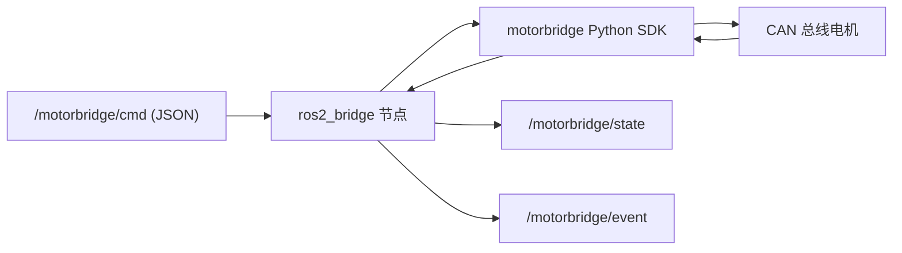

# ros2_bridge

<!-- channel-compat-note -->
## 通道兼容说明（PCAN + CANable candleLight/gs_usb + Damiao 串口桥 + DM_Device）

- Linux SocketCAN 直接使用已初始化的接口名：`can0`、`can1`。CANable 请刷 candleLight/gs_usb 固件，让系统识别为 `can0` 这类 SocketCAN 接口。
- 标准 CAN 推荐 PCAN 或 CANable candleLight/gs_usb。
- 仅 Damiao 可选两类适配器链路：串口桥 `--transport dm-serial --serial-port /dev/ttyACM0 --serial-baud 921600`，以及 DM_Device SDK `--transport dm-device --dm-device-type usb2canfd-dual --dm-channel canfd1|canfd2`。
- Damiao 串口桥完整接口与命令模板见 `motor_cli/README.zh-CN.md` 第 `3.6` 节（英文见 `motor_cli/README.md`）。
- Linux SocketCAN 下 `--channel` 不要带 `@bitrate`（例如 `can0@1000000` 无效）。
- Windows（PCAN 后端）中，`can0/can1` 映射 `PCAN_USBBUS1/2`，可选 `@bitrate` 后缀。


基于 Python（`rclpy`）+ `motorbridge` Python SDK 的 ROS2 桥接。



## 功能

- 订阅命令 topic 并执行电机指令
- 周期发布电机状态
- 通过同一命令 topic 支持运维操作：
  - `scan`
  - `set_id`
  - `verify`

## Topics

- 订阅：`/motorbridge/cmd`（`std_msgs/String`，JSON）
- 发布：
  - `/motorbridge/state`（`std_msgs/String`，JSON）
  - `/motorbridge/event`（`std_msgs/String`，JSON）

## 命令 JSON

控制命令示例：

```json
{"op":"enable"}
{"op":"disable"}
{"op":"mit","pos":0.0,"vel":0.0,"kp":20.0,"kd":1.0,"tau":0.0,"continuous":true}
{"op":"pos_vel","pos":3.10,"vlim":1.50,"continuous":true}
{"op":"vel","vel":0.5,"continuous":true}
{"op":"force_pos","pos":0.8,"vlim":2.0,"ratio":0.3,"continuous":true}
```

标定命令示例：

```json
{"op":"scan","start_id":1,"end_id":16,"feedback_base":16,"timeout_ms":100}
{"op":"set_id","old_motor_id":2,"old_feedback_id":18,"new_motor_id":5,"new_feedback_id":21,"store":true,"verify":true}
{"op":"verify","motor_id":5,"feedback_id":21,"timeout_ms":1000}
```

## 运行

前置：

- 已安装 ROS2（`rclpy`、`std_msgs`）
- 可导入 `motorbridge` Python 包

在仓库根目录执行：

```bash
PYTHONPATH=bindings/python/src:$PYTHONPATH \
python3 integrations/ros2_bridge/python/motorbridge_ros2_bridge.py \
  --channel can0 --model 4340P --motor-id 0x01 --feedback-id 0x11 --dt-ms 20
```

## 命令发布示例

```bash
ros2 topic pub --once /motorbridge/cmd std_msgs/msg/String '{data: "{\"op\":\"enable\"}"}'
ros2 topic pub --once /motorbridge/cmd std_msgs/msg/String '{data: "{\"op\":\"vel\",\"vel\":0.5,\"continuous\":true}"}'
ros2 topic pub --once /motorbridge/cmd std_msgs/msg/String '{data: "{\"op\":\"scan\",\"start_id\":1,\"end_id\":16}"}'
```

## 说明

- `continuous=true` 表示每个定时周期（`--dt-ms`）都会持续发送该控制命令。
- `enable/disable/scan/set_id/verify` 为一次性操作。
